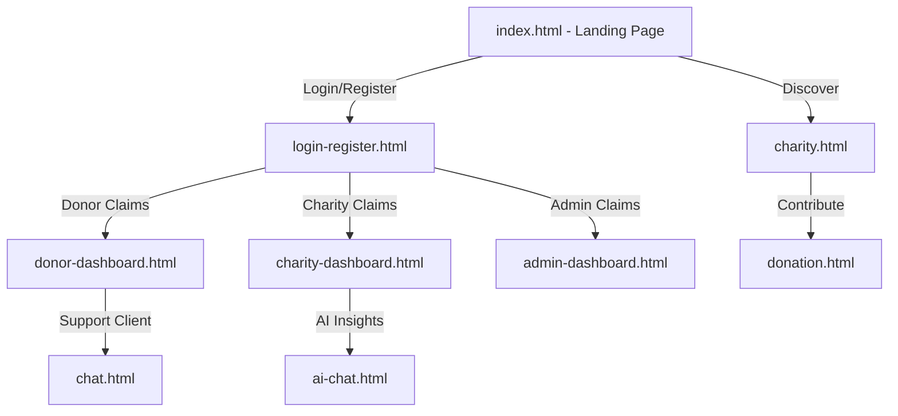

# Ataa Portal: Responsive HTML/CSS/JS Charity Interface & Admin Dashboards

<div align="center">
  
</div>

This repository houses the high-fidelity responsive static frontend templates, custom style systems, and user dashboards for the Ataa Smart Charity Platform. Built using semantic HTML5, custom CSS styling variables, and vanilla JavaScript DOM logic, it functions as the production UI design system prototype for the ecosystem's user portals.

---

## 🧬 System Interfaces & Layouts

The prototype contains the complete design systems and screen states for the following portals:

1.  **Administrative Portal (`admin-dashboard.html`)**: Interactive layout for system managers to approve charity registrations, monitor total platform donation telemetry, and review security logs.
2.  **Charity Portal (`charity-dashboard.html`, `charity.html`)**: Custom dashboard pages for registered non-profits to create campaigns, update funding goals, and verify donation receipts.
3.  **Donor Portal (`donor-dashboard.html`)**: Personal user interface showing contribution histories, monthly donation widgets, and active campaigns.
4.  **Transaction Wizard (`donation.html`)**: Multi-step client donation payment form layout.
5.  **Interactive Modules**: Live chat client interfaces (`chat.html`) and dedicated AI assistant portals (`ai-chat.html`).

---

## 🧬 UI Interaction Flow

The static screens represent the client-side routes and component flows:



---

## 🛠️ Technology Stack & Styling Assets

*   **Structure**: Semantic HTML5 markup ensuring screen reader accessibility and SEO optimization.
*   **Style Engine**: Custom vanilla CSS3 design variables (`css/`), utilizing layout systems (Flexbox, Grid) and responsive media breakpoints.
*   **Interactions**: Vanilla JavaScript DOM controllers (`script/`) managing sidebar toggles, modal overlays, form checks, and tab menus.
*   **Typography**: Integrated webfonts for consistent design layout rendering.

---

## 📂 Repository Module Layout

```text
Ataa-Smart-Charity-Platform/
├── css/                   # Stylesheets (layouts, dashboards, variables)
├── images/                # Theme graphics and media assets
├── script/                # Vanilla JavaScript DOM handlers
├── webfonts/              # Typography font packages
├── index.html             # Ecosystem landing page
├── about.html             # Platform informational overview
├── contact.html           # Communication form
├── donation.html          # Donation multi-step form wizard
├── login-register.html    # Access portal authentication screen
├── admin-dashboard.html   # System management panel
├── charity-dashboard.html # Charity dashboard portal
└── donor-dashboard.html   # Donor activity dashboard
```

---

## ⚡ Local Setup & Execution

Since the project consists of compiled static assets, it has no package build steps or dev runtime dependencies:

```bash
# 1. Clone the organization repository
git clone https://github.com/Ataa-Charity-Viewer-Team/Ataa-Smart-Charity-Platform.git
cd Ataa-Smart-Charity-Platform

# 2. Run a local server (e.g. using Python, Live Server, or Nginx)
# Python 3 example:
python -m http.server 8080

# 3. Open http://localhost:8080 in your browser
```
